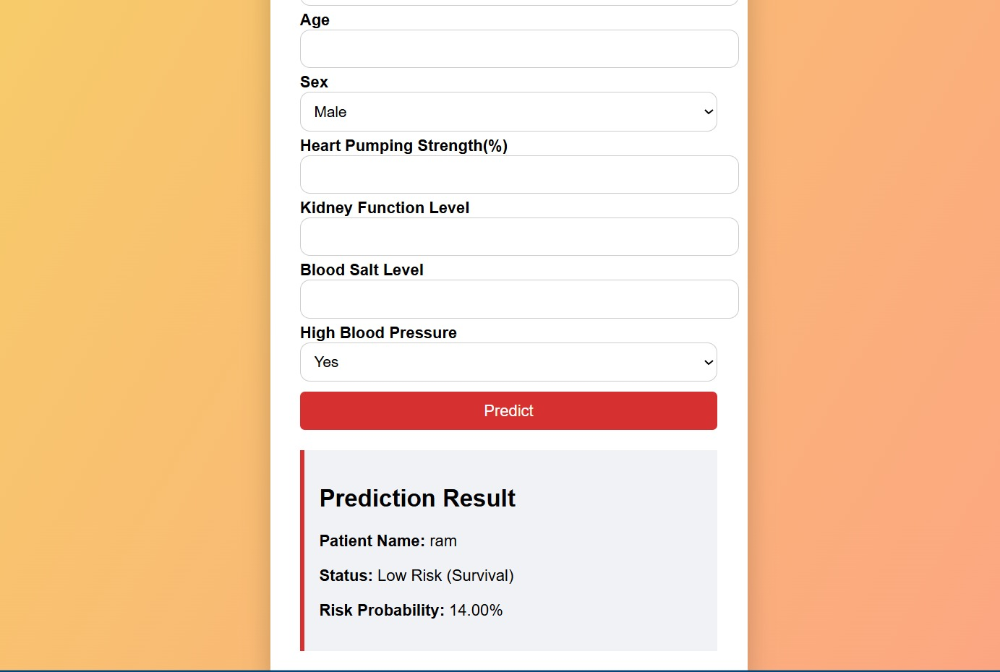
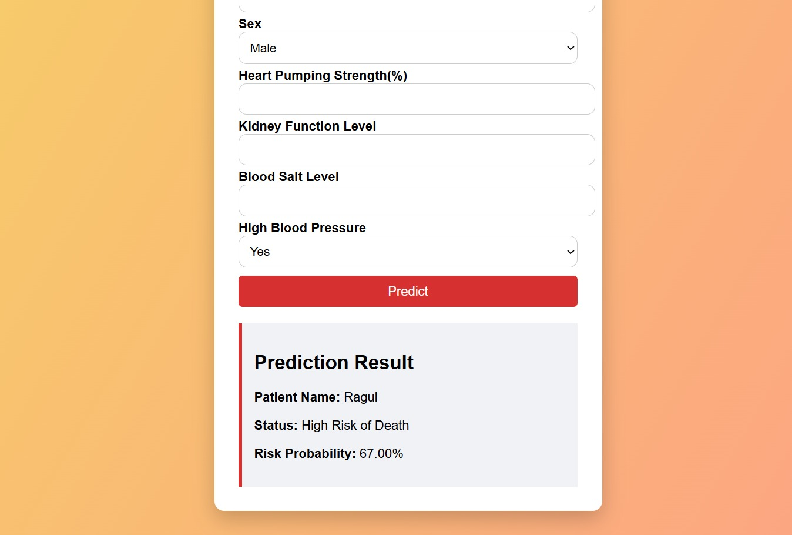

# ❤️ Heart Failure Prediction – Machine Learning Web App

## 📌 Overview

Heart Failure Prediction is an end-to-end **Machine Learning web application** that predicts the **risk of heart failure** using key patient clinical parameters.
The application uses a trained **Random Forest Classifier** and provides **real-time predictions** through a clean and user-friendly **Flask web interface**.

This project demonstrates the complete ML lifecycle:

> Data preprocessing → Model training → Evaluation → Model saving → Web deployment

---

## 🚀 Features

* ✅ Predicts **High Risk / Low Risk** of heart failure
* ✅ Displays **risk probability (%)**
* ✅ Uses **saved ML model** for inference
* ✅ Minimal & patient-friendly inputs
* ✅ Clean, responsive UI
* ✅ Browser tab heart favicon
* ✅ Flask-based deployment

---

## 🧠 Machine Learning Details

### 🔹 Dataset

**Heart Failure Clinical Records Dataset**

### 🔹 Selected Features

| Feature                    | Description       |
| -------------------------- | ----------------- |
| Age                        | Patient age       |
| Sex                        | Male / Female     |
| Heart Pumping Strength (%) | Ejection Fraction |
| Kidney Function Level      | Serum Creatinine  |
| Blood Salt Level           | Serum Sodium      |
| High Blood Pressure        | Yes / No          |

### 🔹 Model

* **Algorithm**: Random Forest Classifier
* **Scaling**: StandardScaler
* **Evaluation Metrics**:

  * Accuracy
  * Confusion Matrix
  * Classification Report

---

## 🔧 Technologies Used

### 🧠 Machine Learning

* Python
* Pandas
* NumPy
* Scikit-learn

### 🌐 Web Development

* Flask
* HTML5
* CSS3

### 💾 Model Persistence

* Joblib
* Random Forest Classifier

### 🛠 Tools

* Jupyter Notebook
* AntiGravity
* Git & GitHub

---

## 📂 Project Structure

```
Heart_failure_prediction/
│
├── app.py
├── MLmodel.ipynb
├── heart_model.pkl
├── scaler.pkl
├── templates/
│   └── index.html
├── static/
│   └── heart.ico
├── screenshots/
│   ├── home.png
│   ├── low_risk.png
│   └── high_risk.png
└── README.md
```

---

## 📸 Screenshots

### 🏠 Home Page – Patient Input Form
A clean and user-friendly interface where users can enter key clinical details such as age, heart pumping strength, kidney function, and blood pressure. The form is designed with minimal inputs to ensure ease of use and clarity.

<p align="center">
  
</p>

### 🟢 Prediction Result – Low Risk
Shows a Low Risk (Survival) prediction with a corresponding probability score, indicating stable heart and kidney function. This helps reassure users when the clinical parameters fall within healthy ranges.

<p align="center">
  
</p>

### 🔴 Prediction Result – High Risk
Displays a High Risk of Heart Failure outcome along with the calculated risk probability based on the patient’s clinical inputs. This result helps identify patients who may require immediate medical attention.

<p align="center">
  
</p>


## ⚙️ How to Run the Project

### 1️⃣ Clone the Repository

```bash
git clone https://github.com/your-username/heart-failure-prediction.git
cd heart-failure-prediction
```

### 2️⃣ Install Dependencies

```bash
pip install -r requirements.txt
```

### 3️⃣ Run Flask App

```bash
python app.py
```

### 4️⃣ Open in Browser

```
http://127.0.0.1:5000
```

---

## 🖥️ Web App Workflow

1. User enters patient clinical details
2. Inputs are scaled using the saved scaler
3. Model predicts heart failure risk
4. Risk category and probability are displayed instantly

---

## 📊 Sample Output

* **Patient Name**: Ragul
* **Status**: Low Risk (Survival)
* **Risk Probability**: 42.00%

---

## ⚠️ Disclaimer

This project is created **for educational purposes only** and should **not** be used as a medical diagnostic tool.

---

## 💡 Future Enhancements

* Add more clinical parameters
* Deploy on cloud (Render / Railway)
* Add charts & feature importance
* Improve UI with Bootstrap
* Add user authentication

---

👤 **RAGUL R**

🔗 LinkedIn: [LinkedIn](https://www.linkedin.com/in/rragul/)   
📧 GitHub: [[ragulr](mailto:ragulrbtechit@gmail.com)]


